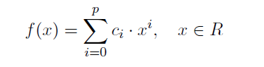

<html>
  <head>
    <h2>Реализация генетического алгоритма</h2>
  </head>
  <body>
    <h3>Информация вычислительного утсройства:</h3>
    
<b>CPU</b>: Intel(R) Core(TM) i5-3470 CPU @ 3.20GHz

    
<b>GPU</b>: NVIDIA GeForce GTX 650 ti

    

      <h3>Исходные файлы:</h3>
      
<i>generate_visual.ipynb</i> - Генерация функции которую нужно аппроксимировать.

      
<i>gen_alg.cu</i> - Программная реализация ГА с использование вычислений на GPU.

   

   <h3>Задание:</h3>
   
<b>CPU</b>: Аппроксимировать полином 4 степени  

   
    
<b>GPU</b> 

